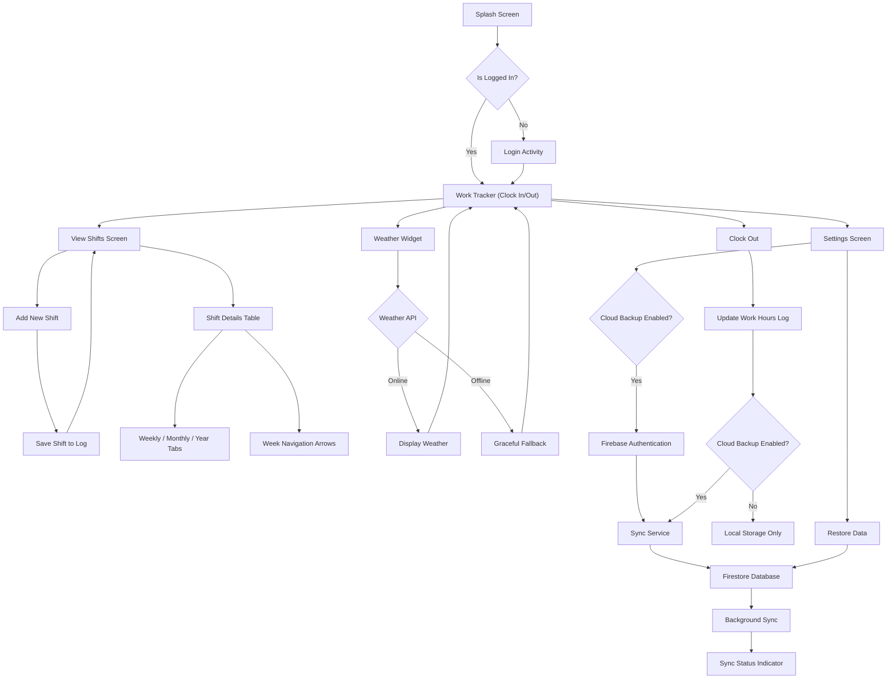

# Work Tracker App Flow Diagram

The following diagram illustrates the user flow through the Work Tracker application, including planned future API integrations.

## Flow Description

### Current App Flow
1. The app starts at the **Splash Screen**.
2. It checks if the user is already logged in.
3. If logged in, the user is directed to the main **Work Tracker** screen where they can clock in or out.
4. If not logged in, the user is directed to the **Login Activity**.
5. From the main screen, users can:
   - View their shifts
   - Clock out of their current shift
6. In the **View Shifts Screen**, users can:
   - See their shift details in a table format
   - Add a new shift manually
7. When adding a new shift, users can save it to their log, which updates the shift list.
8. When clocking out, the app updates the work hours log.
9. The shift details table provides:
   - Weekly/Monthly/Yearly view tabs
   - Navigation arrows to move between weeks

### Future Weather API Integration
1. The main **Work Tracker** screen will include a **Weather Widget**.
2. The widget connects to the **OpenWeatherMap API** to fetch current weather data.
3. If online, it displays current weather conditions relevant to the user's work.
4. If offline, it gracefully falls back to basic functionality.
5. Weather data will be included in shift records for context.

### Future Cloud Backup Integration
1. A new **Settings Screen** will allow users to enable/disable **Cloud Backup**.
2. When enabled, the app will use **Firebase Authentication** for user login.
3. A **Sync Service** will handle data synchronization with **Firestore Database**.
4. **Background Sync** will occur during idle time or when on Wi-Fi.
5. A **Sync Status Indicator** will show the current backup state.
6. When clocking out, shift data will be automatically backed up if enabled.
7. Users can restore their data from the cloud through the Settings screen.
