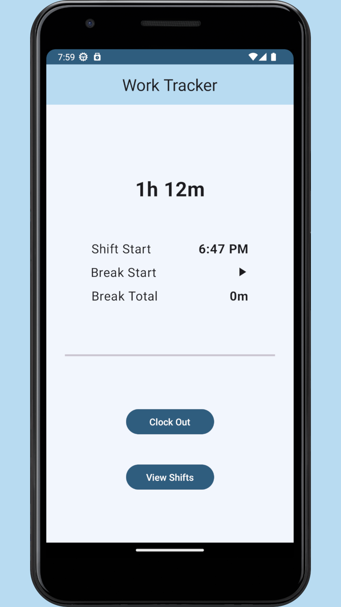
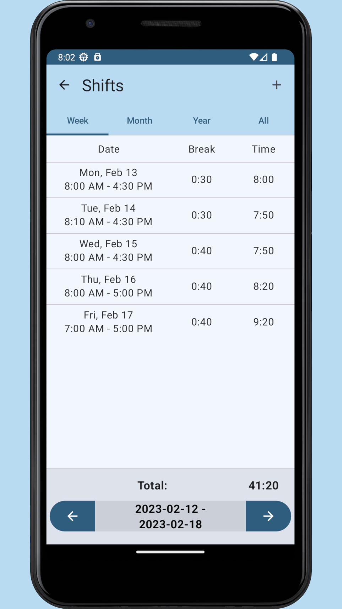
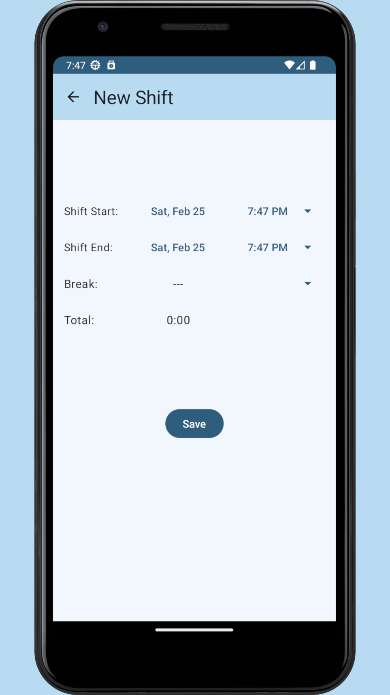
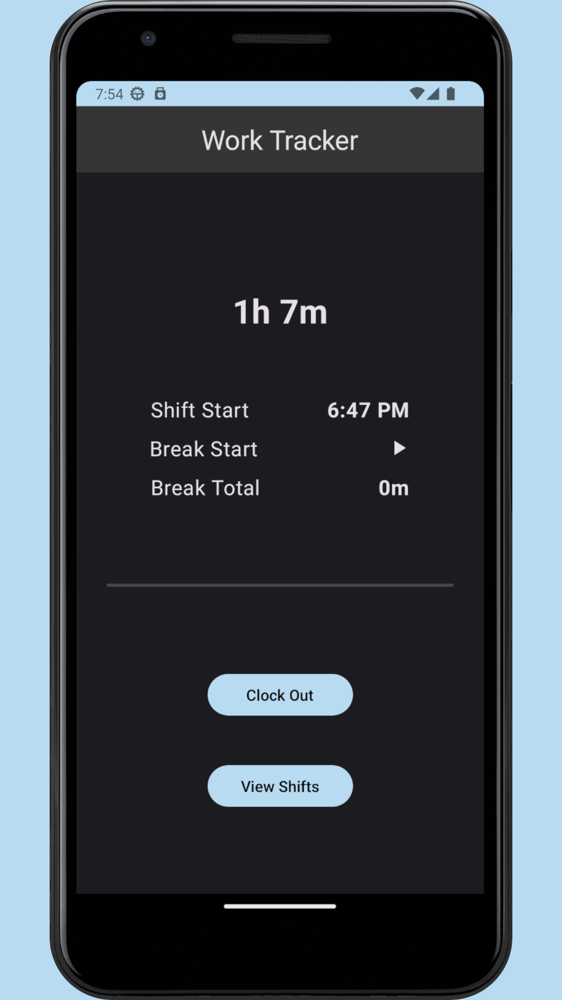
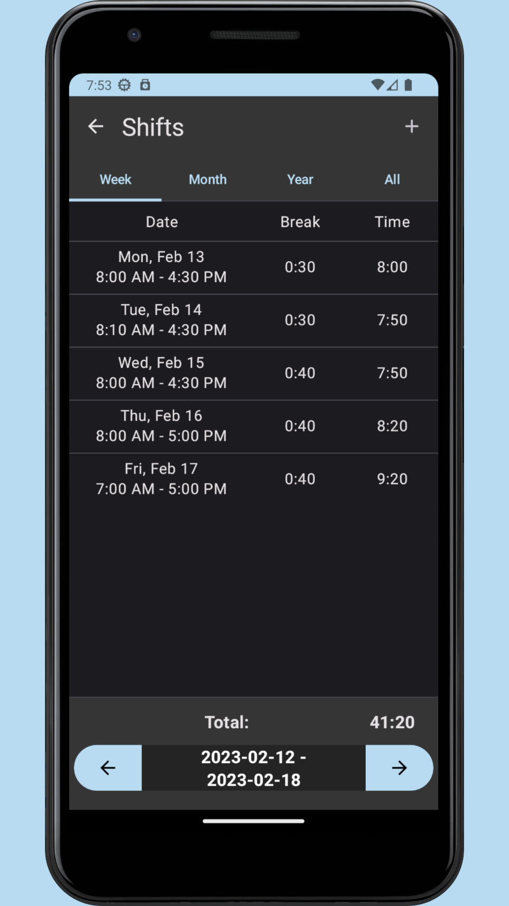
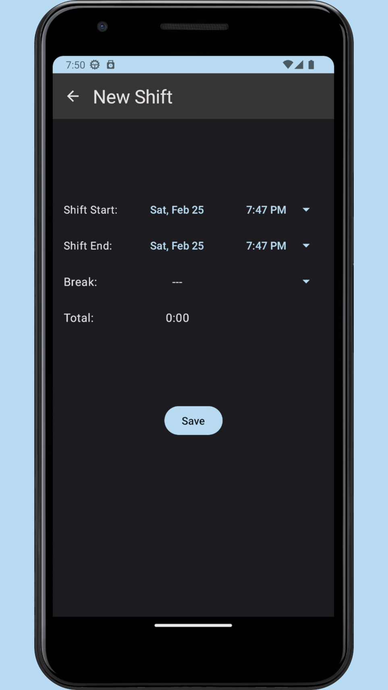

# Work Tracker

Work Tracker is a comprehensive and user-friendly app designed to help you keep a record of your work hours. With its intuitive interface, you can effortlessly log in and out of your shift, no matter where you are. Whether you're clocking in at the office or logging your hours from home, the app has got you covered.

The app accurately tracks the time you spend working and generates detailed reports on your work hours, so you can keep a record of your daily, weekly, and monthly hours worked. With Work Tracker, you'll never have to worry about losing track of your hours or misplacing manual time sheets.

## ✨ New Features and Improvements

### Material 3 UI Modernization

The app has been completely redesigned following Google's Material 3 design principles, offering a more modern, cohesive, and visually appealing experience:

- **Enhanced Color System**: Implemented a comprehensive Material 3 color palette with dynamic color theming for both light and dark modes
- **Modern Typography**: Updated typography system with Material 3 type scale for improved readability and visual hierarchy
- **Standardized Animations**: Created a unified animation system in `Animation.kt` with consistent motion patterns:
  - Custom fade, slide, and scale animations with configurable durations
  - Navigation transitions with coordinated enter/exit animations
  - Interactive feedback animations for UI elements
- **Modern Components**: Replaced legacy UI elements with Material 3 components:
  - `ElevatedCard` for shift items with improved visual hierarchy
  - `FilledTonalButton` and `OutlinedButton` for primary and secondary actions
  - Enhanced `TextField` components with better validation states
- **Improved Layouts**: Redesigned all screens with better information hierarchy and spacing for enhanced usability

### Weather API Integration

Added a new weather widget that enhances the work tracking experience:

- **Weather Data**: Integrated with OpenWeatherMap API to fetch real-time weather data:
  - Current temperature and weather conditions
  - Location-based weather updates
  - Weather description and icon display

- **Location Services**:
  - Permission-based location access for weather data
  - Fallback to last known location when needed
  - Cached location data for offline use

- **Network Layer**:
  - Implemented `RateLimitInterceptor` with exponential backoff for API rate limiting
  - Error handling with user-friendly messages
  - Efficient API communication with Retrofit and OkHttp

- **Weather Widget UI**:
  - Material 3 styled weather display with animations
  - Loading, error, and permission states
  - Integration with the main app workflow

### SQLite Database Improvements

- **Room Database Implementation**:
  - Well-structured database schema using Room persistence library
  - Shift entity with core work data and additional weather information
  - Version management with migration support

- **Repository Pattern**:
  - Clean separation between data sources and business logic
  - Dedicated repositories for shifts, preferences, and weather data
  - Consistent error handling and data validation

- **Data Access**:
  - Efficient database queries through DAO (Data Access Object) pattern
  - Asynchronous operations with coroutines
  - Proper transaction handling for data integrity

### Additional Improvements

- **Time Zone Management**:
  - Comprehensive time zone handling through `TimeZoneInfo`
  - Support for remote work across different time zones

- **Notifications**:
  - Enhanced notification system with `NotificationHandler`
  - Scheduled notifications through `NotificationWorker`
  - Boot-aware notifications with `BootReceiver`

- **Settings and Preferences**:
  - Improved settings screen with Material 3 components
  - Persistent user preferences through `SharedPreferencesRepository`

## Screenshots

  
  

## Technical Architecture

- **MVVM Architecture**:
  - View layer with Jetpack Compose UI components
  - ViewModel layer for business logic and state management
  - Model layer with repositories and data sources
  - Clean separation of concerns for maintainability

- **Jetpack Compose UI**:
  - Modern declarative UI toolkit
  - Reactive UI updates based on state changes
  - Custom composable functions for reusable components
  - Material 3 theming and design system

- **Coroutines & Flow**:
  - Asynchronous programming with coroutines
  - Reactive data streams with Flow
  - StateFlow for observable UI state
  - Structured concurrency for lifecycle management

- **Room Database**:
  - Type-safe database access with Room ORM
  - SQL query validation at compile time
  - Migration support for schema evolution
  - Efficient data access patterns

- **Retrofit & OkHttp**:
  - Type-safe HTTP client for API communication
  - Custom interceptors for rate limiting and logging
  - Efficient request/response handling
  - Proper error management

## Future Development

- Cloud synchronization for multi-device access
- Advanced reporting and analytics
- Team management features
- Integration with calendar and productivity apps
- Expanded weather forecasting for shift planning
